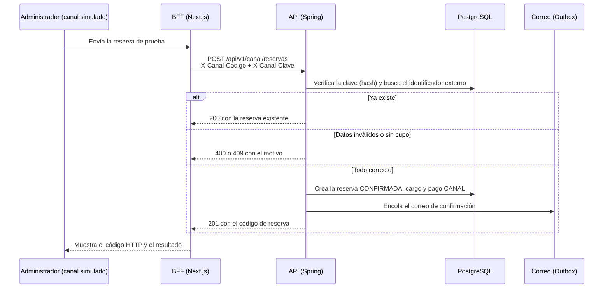

# 19 — Diseño de la integración con canales (Channel Manager)

> **Entregable:** ALC-CM-01 (documento técnico; no es una historia de usuario).
> **Para qué sirve:** explicar qué hace hoy el sistema con los canales externos (Booking y Expedia), qué faltaría para conectarse de verdad y qué limitaciones se aceptan.
> **Relacionado:** documento 14 (AD-13), historias HU-CM-01 a HU-CM-03 y prompts OBJ-1C y OBJ-1E.

---

## 1. Qué es un canal y por qué importa

Un **canal** es un sitio que vende habitaciones del hotel por su cuenta, por ejemplo **Booking** o **Expedia**. Cuando un cliente reserva allí, el canal debe avisar al hotel para que la habitación no se venda dos veces.

Villa Serena es un hotel **ficticio**: no tiene contrato con Booking ni con Expedia. Por eso el sistema demuestra la integración con un **canal simulado** que usa la **API real** del sistema.

---

## 2. Qué hace hoy el sistema

| Pieza | Qué hace | Dónde está |
|---|---|---|
| **API del canal** | `POST /api/v1/canal/reservas` recibe una reserva en JSON | Spring, módulo `canal` (OBJ-1C) |
| **Autenticación** | Cada petición trae el código del canal y su clave en los encabezados `X-Canal-Codigo` y `X-Canal-Clave`. El sistema compara la clave con su **hash** guardado (nunca guarda la clave en texto plano) | Spring |
| **Validación** | Los 6 datos del huésped, 1 a 30 noches, sin fechas pasadas ni a más de 365 días, capacidad del tipo y tipo activo | Spring (las mismas reglas de la web) |
| **Disponibilidad** | Usa **el mismo servicio** que la web pública y Recepción: si no hay cupo, responde `409` | Spring, módulo `reservas` (OBJ-1B) |
| **Sin duplicados** | Si llega dos veces la misma reserva (mismo canal e identificador externo), responde `200` con la reserva existente y no crea otra | Spring y una restricción única en PostgreSQL |
| **Pago** | La reserva nace `CONFIRMADA`, con un cargo por el monto del canal y un pago `APROBADO` con método `CANAL` (el canal cobra al cliente) | Spring |
| **Aviso al huésped** | Se envía el correo de confirmación con el código y el enlace de la app | Outbox (OBJ-1C) |
| **Canal simulado** | Pantalla del Administrador que envía reservas de prueba **a la API real**, con las claves guardadas solo en el servidor | Web, BFF (OBJ-1E) |
| **Visibilidad** | Recepción ve el canal de origen y el identificador externo en la búsqueda, el detalle y el Gantt | Web (OBJ-2D y OBJ-2E) |

### Flujo de una reserva de canal

En una integración real, en lugar del Administrador y el BFF, sería el **servidor del canal** quien llamaría directamente a la API.

---

## 3. Qué faltaría para conectarse de verdad

Esto **no se programa** en este proyecto. Queda como diseño para una versión futura.

| Tema | Hoy | Integración real |
|---|---|---|
| **Formato de los mensajes** | JSON propio, documentado en OpenAPI | Los canales grandes usan sus propios formatos, a menudo basados en el estándar **OTA** (OpenTravel Alliance) en XML: mensajes de reserva, de disponibilidad y de tarifas |
| **Conexión** | API propia con clave por canal | Registrarse en el programa de conectividad de cada canal (por ejemplo, el de socios de Booking o el de Expedia) o contratar un **channel manager** intermediario que ya esté conectado |
| **Seguridad** | Clave por canal guardada con hash | Credenciales del canal, conexiones cifradas (HTTPS) y, según el canal, firmas de los mensajes o listas de direcciones IP permitidas |
| **Disponibilidad y tarifas** | Solo se **reciben** reservas | El hotel también debe **enviar** al canal su disponibilidad y sus precios cada vez que cambian (por ejemplo, al vender una habitación en la web), para que el canal no venda de más |
| **Cancelaciones y cambios** | No existen para reservas de canal | Recibir cancelaciones y modificaciones del canal y aplicarlas a la reserva |
| **Pagos** | Se registra un pago `CANAL` por el total | Cada canal tiene su modelo (el canal cobra y paga al hotel, o el hotel cobra al llegar) y sus comisiones |
| **Pruebas** | Canal simulado | Ambiente de pruebas del canal y **certificación** antes de pasar a producción |
| **Errores y reintentos** | El canal recibe 400, 401 o 409 | Colas de mensajes, reintentos automáticos y avisos al personal cuando un mensaje falla |

**Orden sugerido si algún día se hace:** primero enviar disponibilidad y tarifas (evita la sobreventa), después recibir cancelaciones y, por último, cambiar al formato oficial del canal o a un channel manager.

---

## 4. Limitaciones aceptadas

1. **Las reservas de canal no se cancelan desde el sistema**, ni siquiera si el huésped no llega: quedan `CONFIRMADA`.
2. **No se envía disponibilidad ni tarifas** a los canales. En la demostración no hay riesgo real de sobreventa porque los canales son simulados.
3. **No hay pantalla para administrar canales:** los dos canales y sus claves vienen en los **datos iniciales** (Flyway).
4. **El monto lo define el canal:** el sistema registra el total que envía el canal en un solo cargo; no recalcula el precio por noche.
5. **El huésped se identifica por su correo:** si ya existe, la reserva se asocia a ese perfil sin cambiar sus datos.

---

## 5. Cómo se demuestra

1. El Administrador abre **Canal simulado** y genera una reserva de prueba de Booking → la API responde `201` con el código.
2. Reenvía la misma reserva → la API responde `200` con la misma reserva (no se duplica).
3. Envía una reserva para fechas sin cupo → `409` con el motivo.
4. Recepción la ve en la búsqueda y en el Gantt con el ícono del canal y su identificador externo.
5. El correo de confirmación llega a Mailpit.
