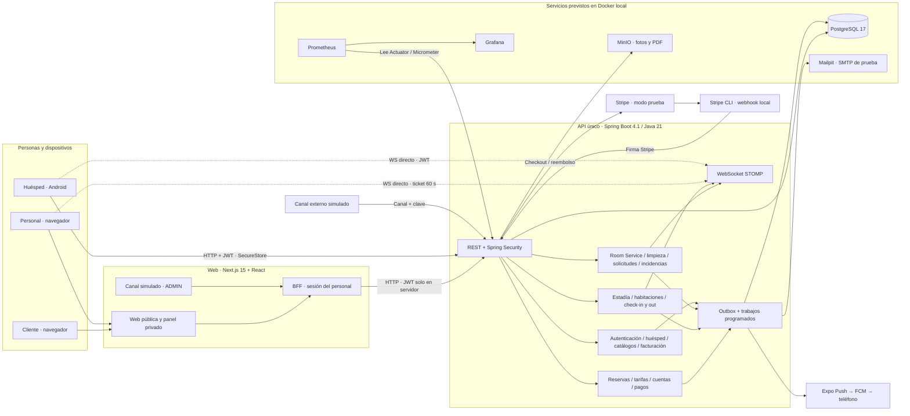

# 01 — Componentes y conexiones

**Vista:** Componentes · **Alcance del plan:** Hito.

Quién llama a quién, dónde se deciden las reglas y cuáles servicios son externos.

## Reglas y límites

- Los recuadros dentro de Spring son módulos de un solo API, no microservicios.
- El Docker local está previsto por la documentación; este atlas no afirma que esté disponible.
- El contrato está en api/openapi.yaml; web y app generan sus tipos por separado.

## Referencias

- [14 §§2–6](../14%20-%20Tecnologias%20y%20Arquitectura.md)
- [09 §§5–7](../09%20-%20Matriz%20de%20Permisos.md)
- [19 §2](../19%20-%20Diseno%20de%20Integracion%20con%20Canales.md)

[Índice de diagramas](README.md) · [Cobertura de historias](COBERTURA.md) · [Siguiente](02-participantes-y-responsabilidades.md)
