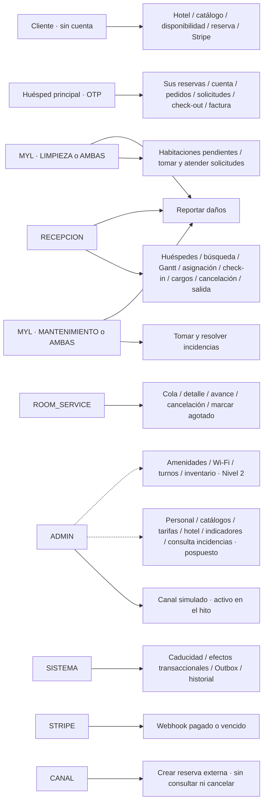

# 02 — Participantes y responsabilidades

**Vista:** Participantes · **Alcance del plan:** Mixto.

Cliente y huésped pueden ser la misma persona; sus accesos y permisos son diferentes.

## Reglas y límites

- MYL es un rol con áreas LIMPIEZA, MANTENIMIENTO o AMBAS.
- ADMIN no hereda permisos de Recepción, Room Service ni piso.
- Administración está documentada como Nivel 1, pero pospuesta del hito por el plan.

## Referencias

- [02](../02%20-%20Definicion%20de%20Roles.md)
- [09 §§3–6](../09%20-%20Matriz%20de%20Permisos.md)
- [12 §2](../12%20-%20Casos%20de%20Uso.md)
- [13 §9](../13%20-%20Plan%20de%20Trabajo.md)

[Índice de diagramas](README.md) · [Cobertura de historias](COBERTURA.md) · [Anterior](01-componentes-y-conexiones.md) · [Siguiente](03-actividad-general-de-la-reserva-a-la-siguiente-llegada.md)
