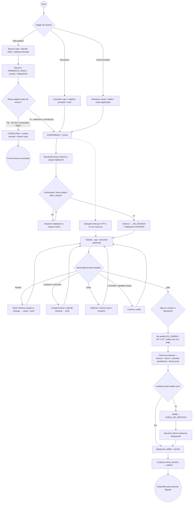

# 03 — Actividad general: de la reserva a la siguiente llegada

**Vista:** Actividad · **Alcance del plan:** Hito.

La columna vertebral del hotel, con tres entradas y un cierre común.

## Reglas y límites

- Los servicios de estadía son opcionales y pueden repetirse; no son pasos obligatorios para salir.
- El acceso OTP puede ocurrir antes del check-in; solo los pedidos y solicitudes exigen EN_ESTADIA.
- Una habitación sucia puede asignarse antes de llegar; para check-in debe estar libre y limpia.

## Referencias

- [01 §4](../01%20-%20Alcance%20del%20Proyecto.md)
- [07 §§3,11](../07%20-%20Estados.md)
- [12 UC-02,03,04](../12%20-%20Casos%20de%20Uso.md)
- [13 objetivos 0–4](../13%20-%20Plan%20de%20Trabajo.md)

[Índice de diagramas](README.md) · [Cobertura de historias](COBERTURA.md) · [Anterior](02-participantes-y-responsabilidades.md) · [Siguiente](04-secuencia-general-del-viaje-del-huesped.md)
