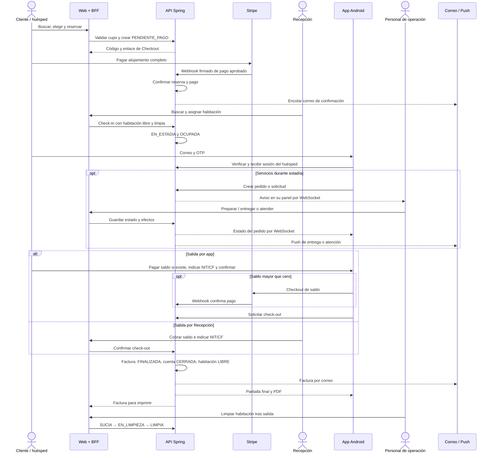

# 04 — Secuencia general del viaje del huésped

**Vista:** Secuencia · **Alcance del plan:** Hito.

Una vista temporal compacta de la experiencia completa y sus participantes.

## Reglas y límites

- Los mensajes resumen casos de uso; no son una lista exhaustiva de endpoints.
- La operación del personal pasa por el BFF; el huésped llama al API directamente.

## Referencias

- [01 §4](../01%20-%20Alcance%20del%20Proyecto.md)
- [12 UC-02,03,04,06,11,13,20](../12%20-%20Casos%20de%20Uso.md)

[Índice de diagramas](README.md) · [Cobertura de historias](COBERTURA.md) · [Anterior](03-actividad-general-de-la-reserva-a-la-siguiente-llegada.md) · [Siguiente](05-actividad-disponibilidad-y-tarifa.md)
