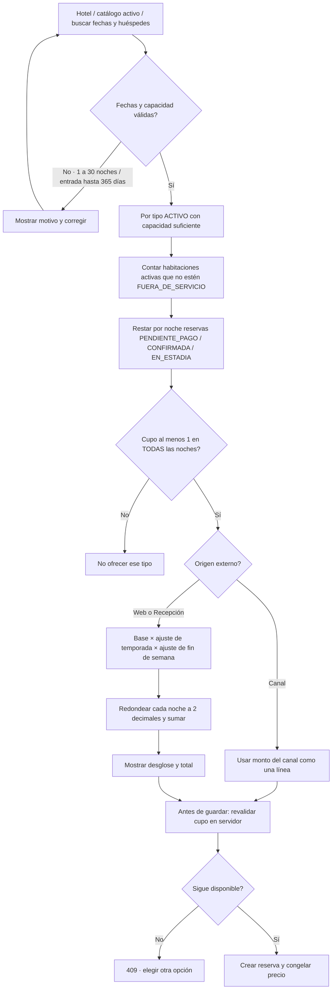

# 05 — Actividad: disponibilidad y tarifa

**Vista:** Actividad · **Alcance del plan:** Hito.

El mismo cálculo sirve a web, Recepción y canal; el canal aporta su propio monto.

## Reglas y límites

- Disponibilidad se comprueba por cada noche, aunque la reserva aún no tenga habitación.
- GTQ, impuestos incluidos y precio fijo al crear la reserva; viernes y sábado son fin de semana.

## Referencias

- [10 RN-RES-001,002,005–008](../10%20-%20Reglas%20de%20Negocio.md)
- [10 RN-TAR-001–010](../10%20-%20Reglas%20de%20Negocio.md)
- [12 UC-01](../12%20-%20Casos%20de%20Uso.md)

**Historias vinculadas:** `HU-HUE-01`, `HU-HUE-02`, `HU-HUE-03`, `HU-HUE-04`, `HU-REC-03`.

[Índice de diagramas](README.md) · [Cobertura de historias](COBERTURA.md) · [Anterior](04-secuencia-general-del-viaje-del-huesped.md) · [Siguiente](06-secuencia-reserva-web-stripe-y-vencimiento.md)
