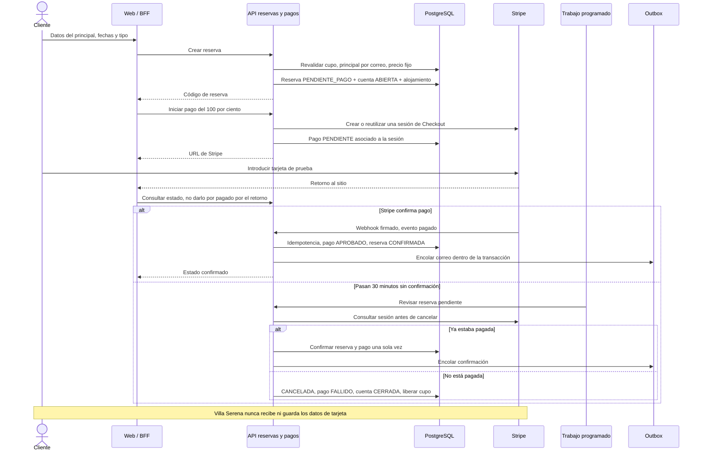

# 06 — Secuencia: reserva web, Stripe y vencimiento

**Vista:** Secuencia · **Alcance del plan:** Hito.

Pagar y volver al sitio no equivale a confirmar: decide el webhook o la conciliación del API.

## Reglas y límites

- Un intento rechazado deja el pago PENDIENTE; se reutiliza la misma sesión de la reserva.
- Antes de cancelar a los 30 minutos se consulta Stripe para no cancelar algo ya pagado.

## Referencias

- [07 R1,R4,R5,P1–P3](../07%20-%20Estados.md)
- [10 RN-PAG-001–006](../10%20-%20Reglas%20de%20Negocio.md)
- [12 UC-02,05,15](../12%20-%20Casos%20de%20Uso.md)

**Historias vinculadas:** `HU-HUE-05`, `HU-HUE-06`, `HU-HUE-07`.

[Índice de diagramas](README.md) · [Cobertura de historias](COBERTURA.md) · [Anterior](05-actividad-disponibilidad-y-tarifa.md) · [Siguiente](07-secuencia-reserva-de-canal-simulado.md)
