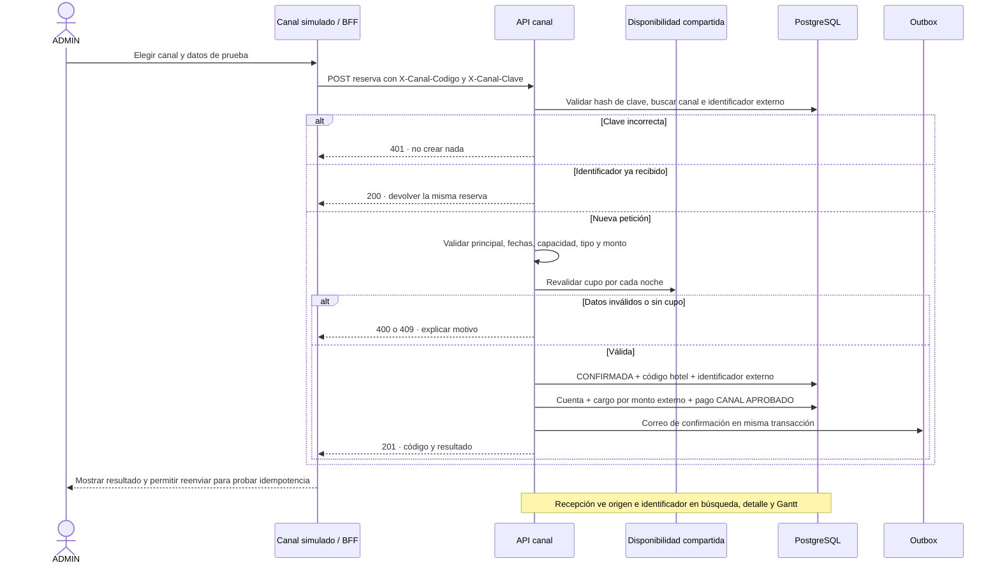

# 07 — Secuencia: reserva de canal simulado

**Vista:** Secuencia · **Alcance del plan:** Hito.

Booking y Expedia son orígenes simulados, no integraciones comerciales reales.

## Reglas y límites

- La clave del canal permanece en el servidor; se compara su hash en Spring.
- No se recalcula el monto externo ni se permiten cancelaciones de esas reservas.

## Referencias

- [19 §§2–4](../19%20-%20Diseno%20de%20Integracion%20con%20Canales.md)
- [10 RN-CM](../10%20-%20Reglas%20de%20Negocio.md)
- [07 R3,P5](../07%20-%20Estados.md)

**Historias vinculadas:** `HU-CM-01`, `HU-CM-02`, `HU-CM-03`.

[Índice de diagramas](README.md) · [Cobertura de historias](COBERTURA.md) · [Anterior](06-secuencia-reserva-web-stripe-y-vencimiento.md) · [Siguiente](08-secuencia-recepcion-asignacion-y-check-in.md)
