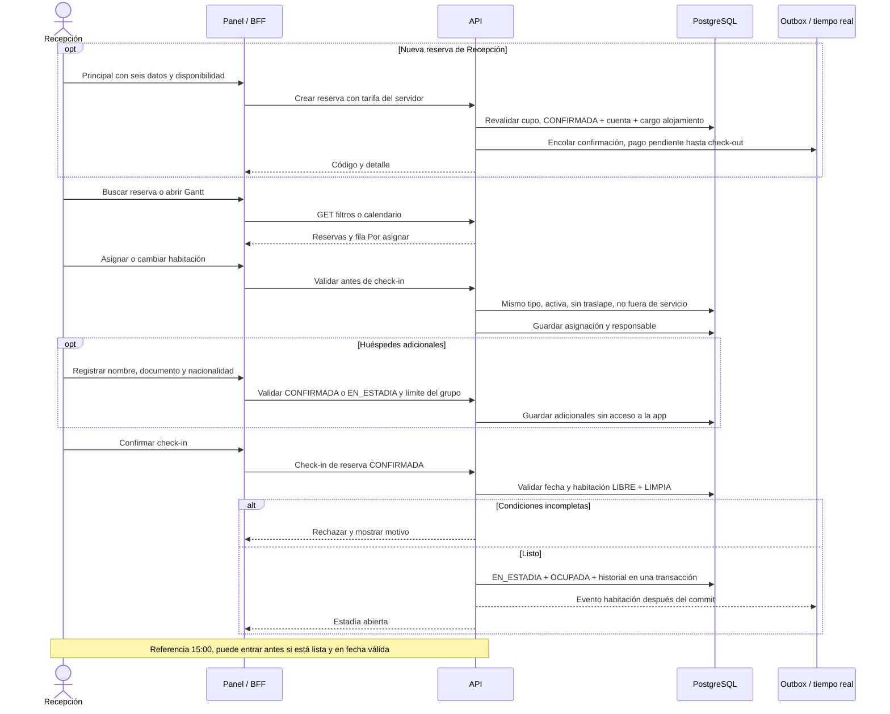

# 08 — Secuencia: Recepción, asignación y check-in

**Vista:** Secuencia · **Alcance del plan:** Hito.

Crear desde Recepción confirma sin cobrar por adelantado; asignar no es hacer check-in.

## Reglas y límites

- Principal y adicionales no pueden superar la cantidad de huéspedes reservada.
- La búsqueda admite nombre, documento, código, fechas y estado; Llegan hoy y Salen hoy son filtros.
- Gantt no arrastra ni modifica reservas y se actualiza al abrir o volver a la pantalla.

## Referencias

- [10 RN-RES-011,013,014,019,020,023,024](../10%20-%20Reglas%20de%20Negocio.md)
- [12 UC-02,03,14](../12%20-%20Casos%20de%20Uso.md)

**Historias vinculadas:** `HU-REC-01`, `HU-REC-02`, `HU-REC-04`, `HU-REC-06`, `HU-REC-07`, `HU-REC-08`, `HU-REC-12`.

[Índice de diagramas](README.md) · [Cobertura de historias](COBERTURA.md) · [Anterior](07-secuencia-reserva-de-canal-simulado.md) · [Siguiente](09-secuencia-sesion-del-personal-y-bff.md)
