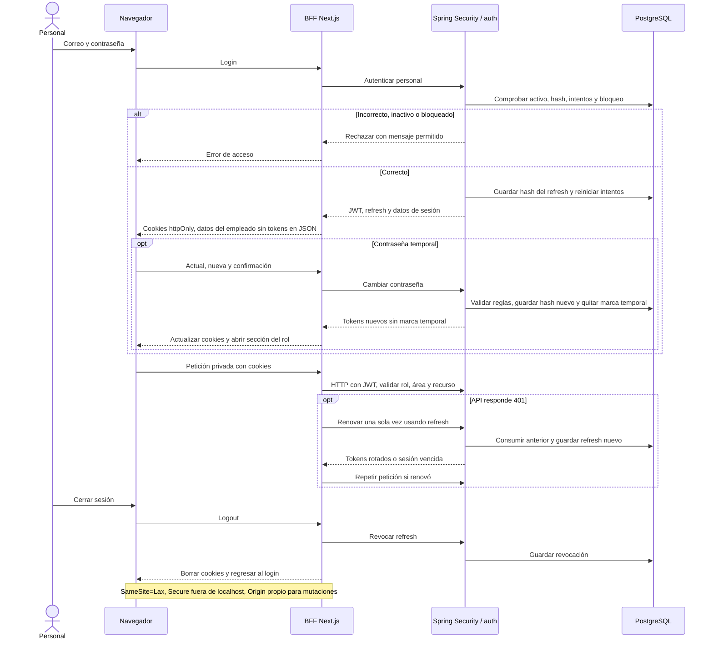

# 09 — Secuencia: sesión del personal y BFF

**Vista:** Secuencia · **Alcance del plan:** Hito.

La cookie vive en el navegador; los tokens del personal permanecen fuera de JavaScript del navegador.

## Reglas y límites

- JWT: 15 minutos; refresh rotativo: 7 días. Cinco fallos bloquean quince minutos.
- Mientras la contraseña sea temporal, cambiarla es obligatorio antes de operar.
- Un empleado inactivo no inicia ni renueva; un acceso ya emitido puede durar hasta vencer.

## Referencias

- [14 §§6,6.1](../14%20-%20Tecnologias%20y%20Arquitectura.md)
- [10 RN-PER-011–015](../10%20-%20Reglas%20de%20Negocio.md)
- [09 §§3.8,7](../09%20-%20Matriz%20de%20Permisos.md)

**Historias vinculadas:** `HU-EMP-01`, `HU-EMP-02`.

[Índice de diagramas](README.md) · [Cobertura de historias](COBERTURA.md) · [Anterior](08-secuencia-recepcion-asignacion-y-check-in.md) · [Siguiente](10-secuencia-otp-mis-reservas-y-sesion-de-la-app.md)
