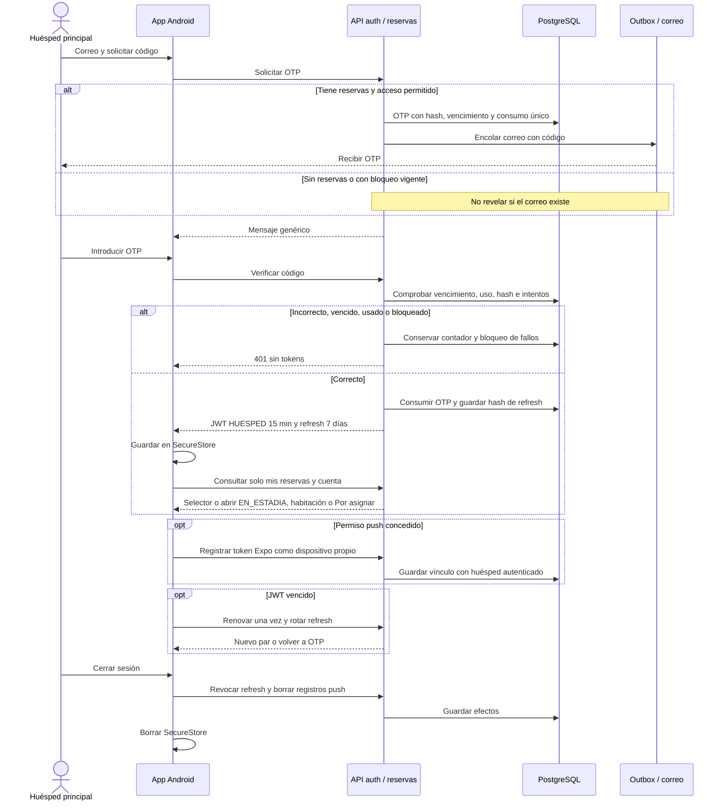

# 10 — Secuencia: OTP, mis reservas y sesión de la app

**Vista:** Secuencia · **Alcance del plan:** Hito.

Solo el huésped principal se autentica; todas sus reservas se vinculan por correo.

## Reglas y límites

- OTP: seis dígitos, diez minutos y un solo uso; cinco verificaciones fallidas bloquean quince minutos.
- Sin reservas se responde el mismo mensaje genérico. Un recurso ajeno responde 404.
- Permiso push rechazado no impide usar la app; cerrar sesión o finalizar borra los dispositivos.

## Referencias

- [10 RN-APP-001–011](../10%20-%20Reglas%20de%20Negocio.md)
- [09 VIS-01,7.2](../09%20-%20Matriz%20de%20Permisos.md)
- [14 §6.1.8](../14%20-%20Tecnologias%20y%20Arquitectura.md)

**Historias vinculadas:** `HU-HUE-08`, `HU-HUE-09`, `HU-HUE-17`.

[Índice de diagramas](README.md) · [Cobertura de historias](COBERTURA.md) · [Anterior](09-secuencia-sesion-del-personal-y-bff.md) · [Siguiente](11-secuencia-pedido-entrega-cargo-y-push.md)
