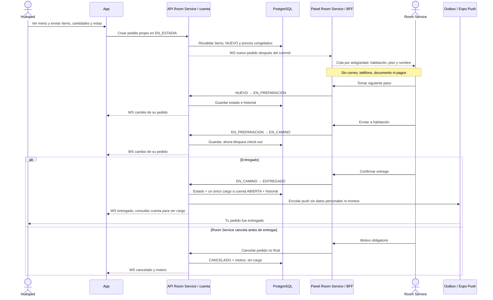

# 11 — Secuencia: pedido, entrega, cargo y push

**Vista:** Secuencia · **Alcance del plan:** Hito.

El cargo aparece al entregar, no al pedir. Estado, cargo y aviso deben quedar coherentes.

## Reglas y límites

- Precios congelados al crear; si un ítem se agotó, se rechaza el pedido completo.
- El huésped no cancela ni modifica el pedido. Room Service cancela estados no finales con motivo.
- ROOM_SERVICE puede marcar agotado; solo ADMIN reactiva. No hay horario ni descuento de inventario.

## Referencias

- [07 S1–S6](../07%20-%20Estados.md)
- [10 RN-RS](../10%20-%20Reglas%20de%20Negocio.md)
- [09 VIS-02](../09%20-%20Matriz%20de%20Permisos.md)
- [12 UC-06](../12%20-%20Casos%20de%20Uso.md)

**Historias vinculadas:** `HU-HUE-10`, `HU-HUE-11`, `HU-RS-01`, `HU-RS-02`, `HU-RS-03`, `HU-RS-04`, `HU-RS-05`, `HU-RS-06`, `HU-RS-07`.

[Índice de diagramas](README.md) · [Cobertura de historias](COBERTURA.md) · [Anterior](10-secuencia-otp-mis-reservas-y-sesion-de-la-app.md) · [Siguiente](12-secuencia-limpieza-o-articulos-solicitados.md)
