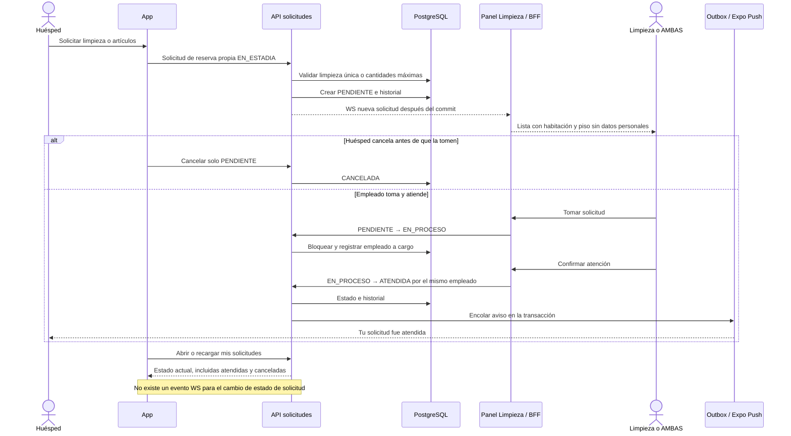

# 12 — Secuencia: limpieza o artículos solicitados

**Vista:** Secuencia · **Alcance del plan:** Hito.

Las solicitudes van directamente a Limpieza; su seguimiento en la app se recarga por consulta.

## Reglas y límites

- Una sola solicitud de limpieza PENDIENTE o EN_PROCESO por habitación.
- Artículos respetan su máximo de catálogo. No consumen inventario ni crean cargos documentados.
- Solicitar o tomar limpieza no cambia la condición de la habitación.

## Referencias

- [07 Q1–Q5](../07%20-%20Estados.md)
- [10 RN-LIM-003–015](../10%20-%20Reglas%20de%20Negocio.md)
- [12 UC-13](../12%20-%20Casos%20de%20Uso.md)

**Historias vinculadas:** `HU-HUE-12`, `HU-HUE-13`, `HU-HUE-14`, `HU-MYL-04`, `HU-MYL-05`.

[Índice de diagramas](README.md) · [Cobertura de historias](COBERTURA.md) · [Anterior](11-secuencia-pedido-entrega-cargo-y-push.md) · [Siguiente](13-actividad-limpieza-de-habitaciones-libres.md)
