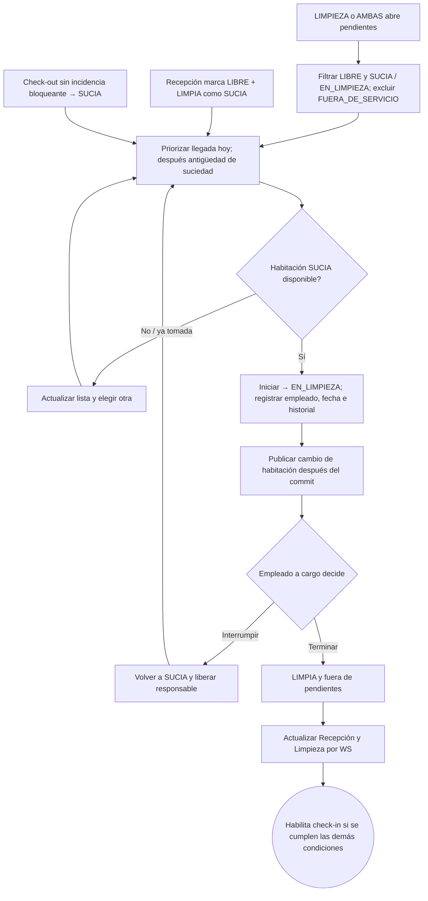

# 13 — Actividad: limpieza de habitaciones libres

**Vista:** Actividad · **Alcance del plan:** Hito.

Este flujo es diferente de atender una solicitud de un huésped alojado.

## Reglas y límites

- Las ocupadas no aparecen en esta lista; se atienden mediante solicitud del huésped.
- Recepción solo puede marcar SUCIA una LIBRE + LIMPIA; no puede marcar LIMPIA.

## Referencias

- [10 RN-LIM-001,002,004,010,011](../10%20-%20Reglas%20de%20Negocio.md)
- [07 C2–C5](../07%20-%20Estados.md)
- [12 UC-07](../12%20-%20Casos%20de%20Uso.md)

**Historias vinculadas:** `HU-REC-10`, `HU-REC-11`, `HU-MYL-01`, `HU-MYL-02`, `HU-MYL-03`.

[Índice de diagramas](README.md) · [Cobertura de historias](COBERTURA.md) · [Anterior](12-secuencia-limpieza-o-articulos-solicitados.md) · [Siguiente](14-actividad-incidencia-y-recuperacion-de-habitacion.md)
