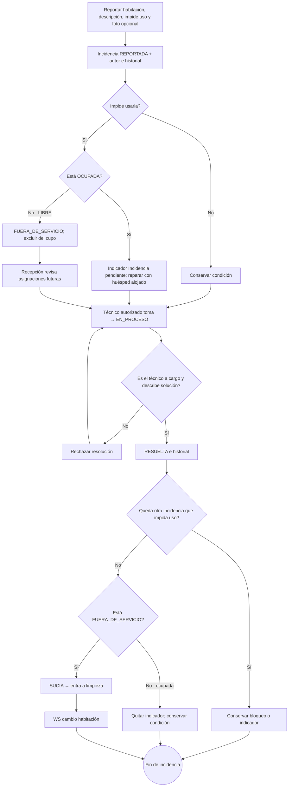

# 14 — Actividad: incidencia y recuperación de habitación

**Vista:** Actividad · **Alcance del plan:** Hito.

Un daño con huésped alojado se atiende sin cambiarlo de habitación.

## Reglas y límites

- Reporta Recepción o cualquier área MYL; toma y resuelve MANTENIMIENTO o AMBAS.
- Solo el técnico a cargo resuelve, con solución obligatoria. No hay reasignación ni repuestos.
- Recepción revisa futuras asignaciones en el calendario; no hay aviso automático para esas reservas.

## Referencias

- [10 RN-MAN](../10%20-%20Reglas%20de%20Negocio.md)
- [10 RN-HAB-001–003,006](../10%20-%20Reglas%20de%20Negocio.md)
- [12 UC-08](../12%20-%20Casos%20de%20Uso.md)

**Historias vinculadas:** `HU-REC-17`, `HU-MYL-06`, `HU-MYL-07`, `HU-MYL-08`.

[Índice de diagramas](README.md) · [Cobertura de historias](COBERTURA.md) · [Anterior](13-actividad-limpieza-de-habitaciones-libres.md) · [Siguiente](15-secuencia-cuenta-cargos-y-saldo.md)
