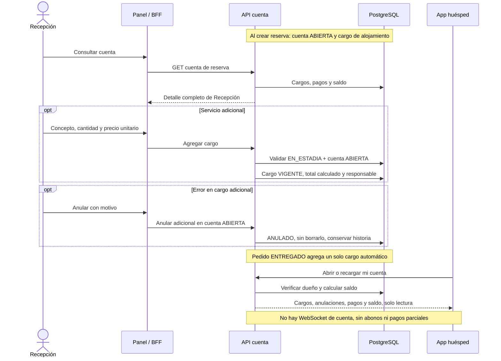

# 15 — Secuencia: cuenta, cargos y saldo

**Vista:** Secuencia · **Alcance del plan:** Hito.

Una cuenta por reserva reúne alojamiento, servicios, room service y pagos.

## Reglas y límites

- Saldo = cargos VIGENTE − pagos APROBADO; anulados, pendientes, fallidos y reembolsados no suman.
- Solo adicionales se anulan, con motivo; nunca se borran cargos ni se anula alojamiento.
- El huésped puede consultar la cuenta en cualquier estado, con actualización al abrir o recargar.

## Referencias

- [07 §5](../07%20-%20Estados.md)
- [10 RN-PAG-009–021](../10%20-%20Reglas%20de%20Negocio.md)
- [12 UC-04](../12%20-%20Casos%20de%20Uso.md)

**Historias vinculadas:** `HU-REC-13`, `HU-HUE-15`.

[Índice de diagramas](README.md) · [Cobertura de historias](COBERTURA.md) · [Anterior](14-actividad-incidencia-y-recuperacion-de-habitacion.md) · [Siguiente](16-actividad-cancelar-reserva-y-reembolsar.md)
