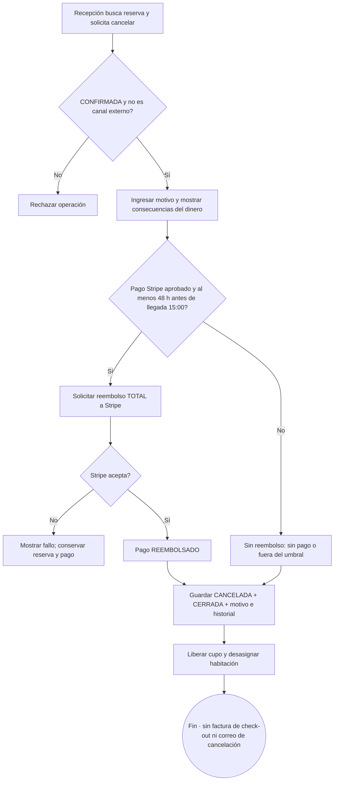

# 16 — Actividad: cancelar reserva y reembolsar

**Vista:** Actividad · **Alcance del plan:** Hito.

Recepción cancela solo CONFIRMADA de origen directo; canal permanece fuera de esta operación.

## Reglas y límites

- 48 horas se cuentan antes de las 15:00 del día de llegada.
- Si Stripe rechaza el reembolso, la reserva no se cancela. No se envía correo de cancelación.
- No-show no es un estado: No se presentó es un motivo de cancelación manual sin reembolso.

## Referencias

- [10 RN-CAN](../10%20-%20Reglas%20de%20Negocio.md)
- [07 R7](../07%20-%20Estados.md)
- [12 UC-10](../12%20-%20Casos%20de%20Uso.md)

**Historias vinculadas:** `HU-REC-05`.

[Índice de diagramas](README.md) · [Cobertura de historias](COBERTURA.md) · [Anterior](15-secuencia-cuenta-cargos-y-saldo.md) · [Siguiente](17-actividad-decisiones-del-check-out.md)
