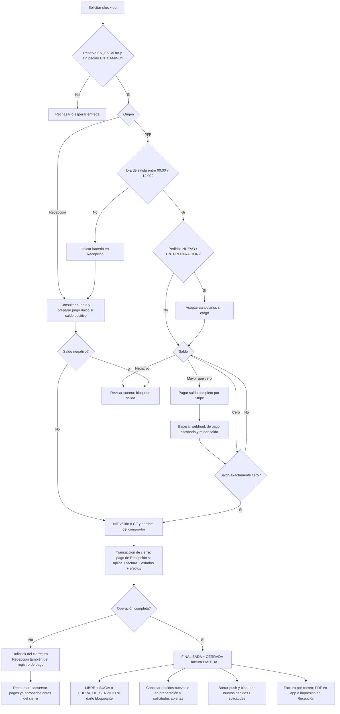

# 17 — Actividad: decisiones del check-out

**Vista:** Actividad · **Alcance del plan:** Hito.

Una única salida funcional, con dos caminos de pago y reglas de bloqueo explícitas.

## Reglas y límites

- Salida tarde se resuelve en Recepción; no hay proceso ni recargo automático.
- Saldo negativo también bloquea: el requisito es exactamente cero.
- Si falla el cierre, el pago Stripe previamente aprobado se conserva para reintentar sin cobrar otra vez.

## Referencias

- [10 RN-RES-015,021,022](../10%20-%20Reglas%20de%20Negocio.md)
- [10 RN-APP-008](../10%20-%20Reglas%20de%20Negocio.md)
- [10 RN-RS-011](../10%20-%20Reglas%20de%20Negocio.md)
- [12 UC-04](../12%20-%20Casos%20de%20Uso.md)

**Historias vinculadas:** `HU-HUE-16`, `HU-REC-14`.

[Índice de diagramas](README.md) · [Cobertura de historias](COBERTURA.md) · [Anterior](16-actividad-cancelar-reserva-y-reembolsar.md) · [Siguiente](18-secuencia-cierre-atomico-factura-y-archivos.md)
