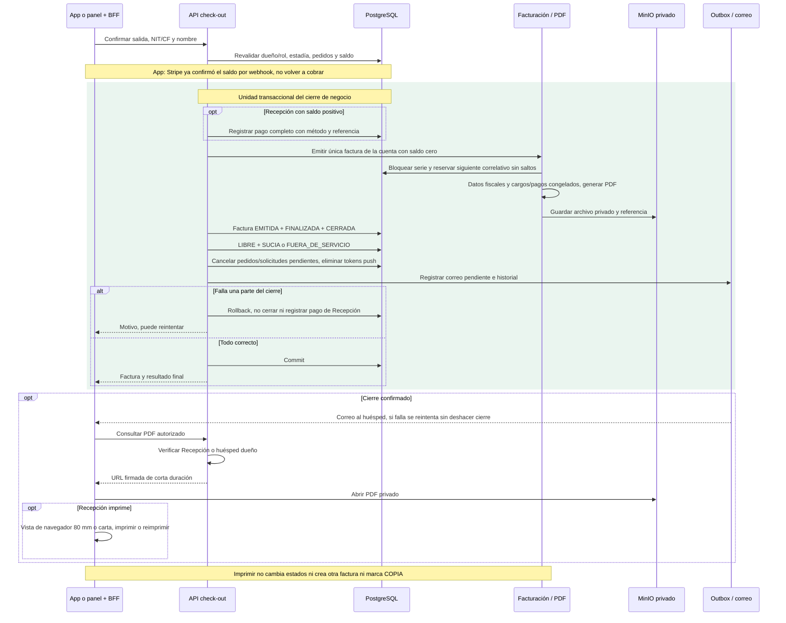

# 18 — Secuencia: cierre atómico, factura y archivos

**Vista:** Secuencia · **Alcance del plan:** Hito.

Distingue el pago Stripe previo del cierre transaccional y del envío posterior de correo.

## Reglas y límites

- Una factura por cuenta, correlativo consecutivo de serie fija, NIT con verificador o CF.
- Factura de demostración, IVA incluido sin desglose, inmutable y sin anulación.
- La transacción descrita garantiza los cambios de negocio en BD; correo es posterior y los archivos requieren coordinación, no una transacción distribuida implícita.

## Referencias

- [07 R8,F1,K2,C1,C7,Q5,S6](../07%20-%20Estados.md)
- [10 RN-FAC](../10%20-%20Reglas%20de%20Negocio.md)
- [09 §7.5](../09%20-%20Matriz%20de%20Permisos.md)
- [12 UC-04,20](../12%20-%20Casos%20de%20Uso.md)

**Historias vinculadas:** `HU-REC-15`, `HU-REC-16`.

[Índice de diagramas](README.md) · [Cobertura de historias](COBERTURA.md) · [Anterior](17-actividad-decisiones-del-check-out.md) · [Siguiente](19-secuencia-conexiones-y-cuatro-eventos-en-vivo.md)
