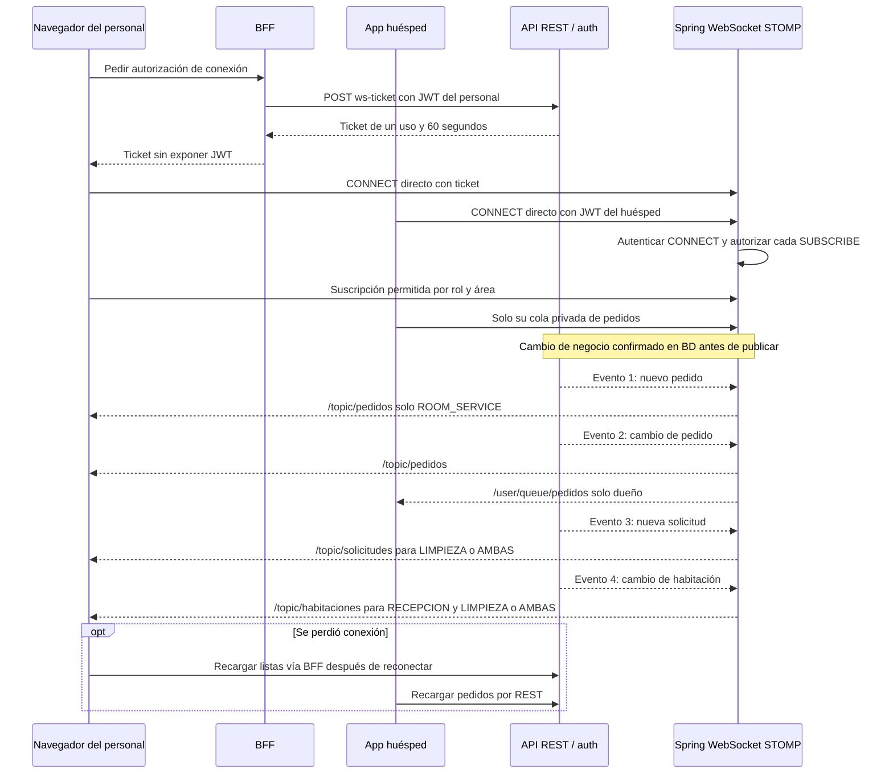

# 19 — Secuencia: conexiones y cuatro eventos en vivo

**Vista:** Secuencia · **Alcance del plan:** Hito.

WebSocket es una excepción al camino HTTP de la web por el BFF.

## Reglas y límites

- Solo cuatro eventos: nuevo pedido, cambio de pedido, nueva solicitud y cambio de habitación.
- No hay WS para Gantt, cuenta, solicitudes de la app, incidencias ni indicadores.
- Se publica después del commit y al reconectar se vuelve a leer el estado con GET.

## Referencias

- [14 §§6,6.1](../14%20-%20Tecnologias%20y%20Arquitectura.md)
- [09 §7.4](../09%20-%20Matriz%20de%20Permisos.md)
- [07 §12.1](../07%20-%20Estados.md)
- [OpenAPI x-websocket](https://github.com/villaserenaguate/villa-serena-api/blob/main/openapi.yaml)

[Índice de diagramas](README.md) · [Cobertura de historias](COBERTURA.md) · [Anterior](18-secuencia-cierre-atomico-factura-y-archivos.md) · [Siguiente](20-secuencia-outbox-correos-y-notificaciones-push.md)
