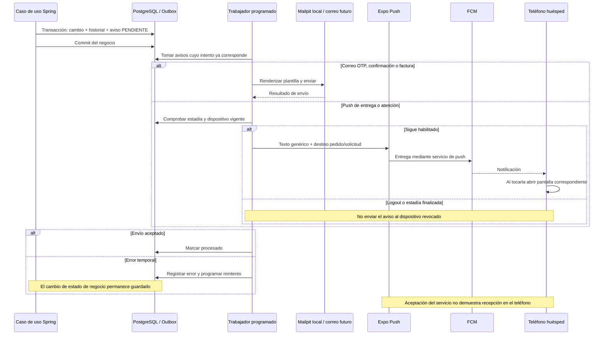

# 20 — Secuencia: Outbox, correos y notificaciones push

**Vista:** Secuencia · **Alcance del plan:** Hito.

Persistir un cambio y enviar un aviso son momentos diferentes.

## Reglas y límites

- Tres correos: OTP, confirmación y factura. Dos push: pedido entregado y solicitud atendida.
- Push exige EN_ESTADIA y permiso del teléfono; no incluye nombres, datos personales ni montos.
- Development build para push; la vista local Mailpit sirve para comprobar correo. Este atlas no ejecuta esas pruebas.

## Referencias

- [14 AD-12,§5](../14%20-%20Tecnologias%20y%20Arquitectura.md)
- [07 §§11,12.2,12.3](../07%20-%20Estados.md)
- [10 RN-NOT](../10%20-%20Reglas%20de%20Negocio.md)
- [OpenAPI x-push](https://github.com/villaserenaguate/villa-serena-api/blob/main/openapi.yaml)

[Índice de diagramas](README.md) · [Cobertura de historias](COBERTURA.md) · [Anterior](19-secuencia-conexiones-y-cuatro-eventos-en-vivo.md) · [Siguiente](21-estados-reserva-cuenta-pago-cargo-y-factura.md)
