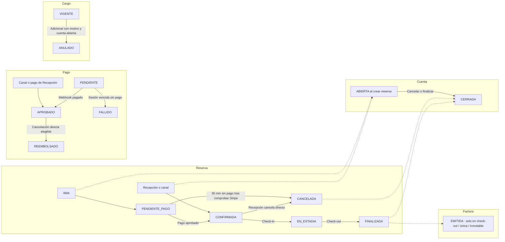

# 21 — Estados: reserva, cuenta, pago, cargo y factura

**Vista:** Estados · **Alcance del plan:** Hito.

Cinco ciclos distintos que se relacionan sin confundirse.

## Reglas y límites

- Reserva cancelada cierra la cuenta tal como está; solo el check-out emite factura.
- PENDIENTE_PAGO, CONFIRMADA y EN_ESTADIA consumen cupo. CANCELADA y FINALIZADA son finales.
- Pago rechazado no es FALLIDO: el intento deja PENDIENTE hasta vencimiento de sesión.

## Referencias

- [07 §§3,5](../07%20-%20Estados.md)
- [10 RN-PAG,RN-CAN,RN-FAC](../10%20-%20Reglas%20de%20Negocio.md)

[Índice de diagramas](README.md) · [Cobertura de historias](COBERTURA.md) · [Anterior](20-secuencia-outbox-correos-y-notificaciones-push.md) · [Siguiente](22-estados-ocupacion-y-condicion-de-habitacion.md)
