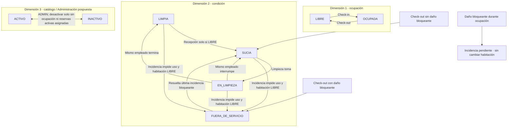

# 22 — Estados: ocupación y condición de habitación

**Vista:** Estados · **Alcance del plan:** Hito.

LIBRE no significa LIMPIA; la habitación tiene ocupación, condición y activación de catálogo.

## Reglas y límites

- La nueva habitación nace LIBRE + LIMPIA y activa.
- Una incidencia bloqueante en OCUPADA muestra un indicador; cambia a FUERA_DE_SERVICIO al salir si sigue abierta.
- La solicitud del huésped no cambia la condición; el flujo de limpieza libre es independiente.

## Referencias

- [07 §4](../07%20-%20Estados.md)
- [10 RN-HAB](../10%20-%20Reglas%20de%20Negocio.md)
- [10 RN-LIM-001,002](../10%20-%20Reglas%20de%20Negocio.md)

[Índice de diagramas](README.md) · [Cobertura de historias](COBERTURA.md) · [Anterior](21-estados-reserva-cuenta-pago-cargo-y-factura.md) · [Siguiente](23-estados-pedidos-solicitudes-e-incidencias.md)
