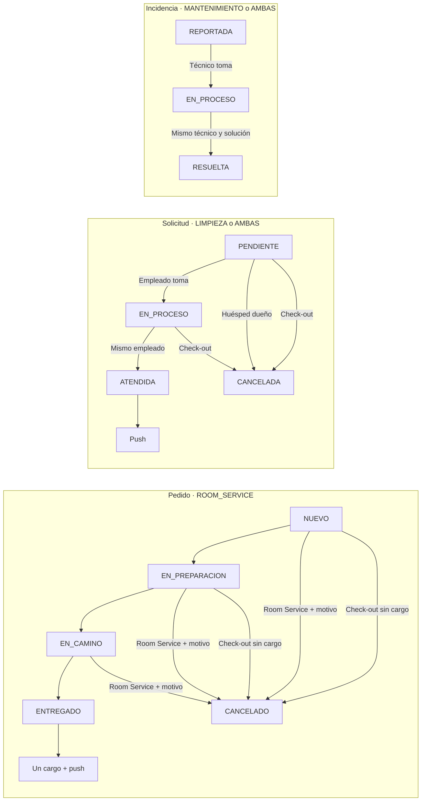

# 23 — Estados: pedidos, solicitudes e incidencias

**Vista:** Estados · **Alcance del plan:** Hito.

Cada operación tiene una máquina de estados y responsables distintos.

## Reglas y límites

- Los estados finales no se reabren ni se retroceden.
- Check-out cancela pedidos nuevos/en preparación y solicitudes pendientes/en proceso.
- EN_CAMINO bloquea salida. Solo el empleado/técnico a cargo atiende o resuelve.

## Referencias

- [07 §§6–8](../07%20-%20Estados.md)
- [10 RN-RS,RN-LIM,RN-MAN](../10%20-%20Reglas%20de%20Negocio.md)

[Índice de diagramas](README.md) · [Cobertura de historias](COBERTURA.md) · [Anterior](22-estados-ocupacion-y-condicion-de-habitacion.md) · [Siguiente](24-secuencia-administracion-y-configuracion.md)
