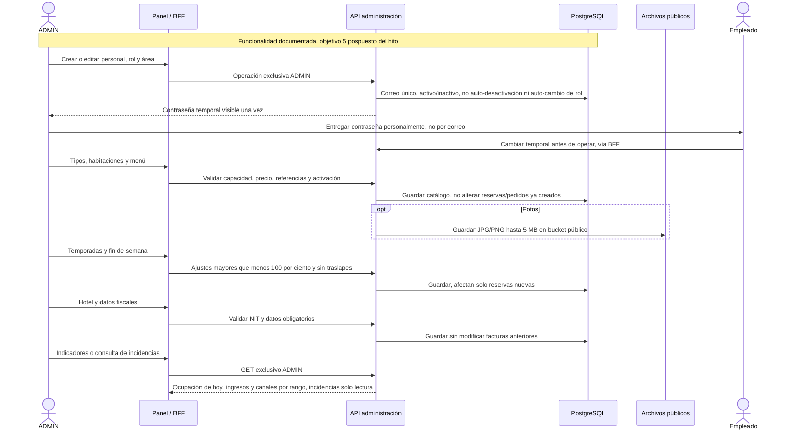

# 24 — Secuencia: Administración y configuración

**Vista:** Secuencia · **Alcance del plan:** Pospuesto.

El objetivo 5 está en la especificación, pero el plan lo reemplaza por datos iniciales para el hito.

## Reglas y límites

- En el hito: personal, catálogos, temporadas, menú, hotel y serie se precargan con Flyway; primer ADMIN por entorno.
- La serie y el correlativo inicial no se editan; cambios del hotel no alteran facturas antiguas.
- Ingreso = pagos aprobados del rango; ocupación de hoy = ocupadas/activas; reservas por canal incluyen canceladas.

## Referencias

- [04 HU Administrador](../04%20-%20Historias%20de%20Usuario/HU%20-%20Administrador.md)
- [10 RN-PER,RN-TAR,RN-HAB,RN-IND,RN-FAC](../10%20-%20Reglas%20de%20Negocio.md)
- [13 §9.1](../13%20-%20Plan%20de%20Trabajo.md)

**Historias vinculadas:** `HU-ADM-01`, `HU-ADM-02`, `HU-ADM-03`, `HU-ADM-04`, `HU-ADM-05`, `HU-ADM-06`, `HU-ADM-07`, `HU-ADM-08`, `HU-ADM-09`, `HU-ADM-10`.

[Índice de diagramas](README.md) · [Cobertura de historias](COBERTURA.md) · [Anterior](23-estados-pedidos-solicitudes-e-incidencias.md) · [Siguiente](25-actividad-las-cinco-historias-opcionales.md)
