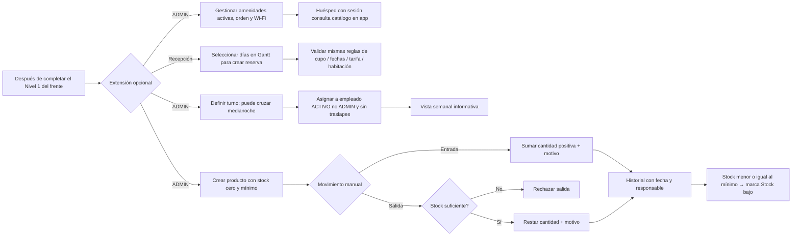

# 25 — Actividad: las cinco historias opcionales

**Vista:** Actividad · **Alcance del plan:** Nivel 2.

Extensiones documentadas, independientes del flujo obligatorio del hito.

## Reglas y límites

- Inventario aislado: solo movimientos manuales de ADMIN; no hay flechas desde pedidos, limpieza ni mantenimiento.
- Turnos informativos: no condicionan autenticación ni acceso al sistema.
- Amenidades y Wi-Fi son visibles a cualquier huésped con sesión, sin depender de EN_ESTADIA.

## Referencias

- [10 RN-INV,RN-TUR,RN-APP-012,RN-RES-025](../10%20-%20Reglas%20de%20Negocio.md)
- [13 objetivo 6](../13%20-%20Plan%20de%20Trabajo.md)
- [01 §5](../01%20-%20Alcance%20del%20Proyecto.md)

**Historias vinculadas:** `HU-HUE-18`, `HU-REC-09`, `HU-ADM-11`, `HU-ADM-12`, `HU-ADM-13`.

[Índice de diagramas](README.md) · [Cobertura de historias](COBERTURA.md) · [Anterior](24-secuencia-administracion-y-configuracion.md) · [Siguiente](26-componentes-despliegue-entrega-y-backups-futuros.md)
