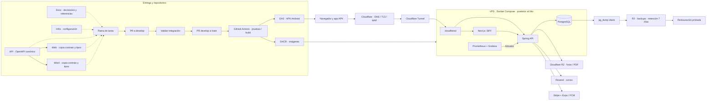

# 26 — Componentes: despliegue, entrega y backups futuros

**Vista:** Componentes · **Alcance del plan:** Después.

El diseño posterior al hito local; no es una descripción de infraestructura ya instalada.

## Reglas y límites

- Cinco repositorios: docs, infra, api, web y movil. No hay monorepo ni paquete shared.
- Git: rama de tarea → PR a develop → verificar integración → PR a main para entrega.
- Backups: pg_dump diario a R2, siete días de retención y restauración probada.
- Loki y alerta por caída/consumo son Nivel 2; Grafana/Prometheus locales siguen en el hito.

## Referencias

- [14 §§3.2,9,10,11](../14%20-%20Tecnologias%20y%20Arquitectura.md)
- [01 §6](../01%20-%20Alcance%20del%20Proyecto.md)
- [CONTRIBUTING §§2,5](../CONTRIBUTING.md)

[Índice de diagramas](README.md) · [Cobertura de historias](COBERTURA.md) · [Anterior](25-actividad-las-cinco-historias-opcionales.md)
